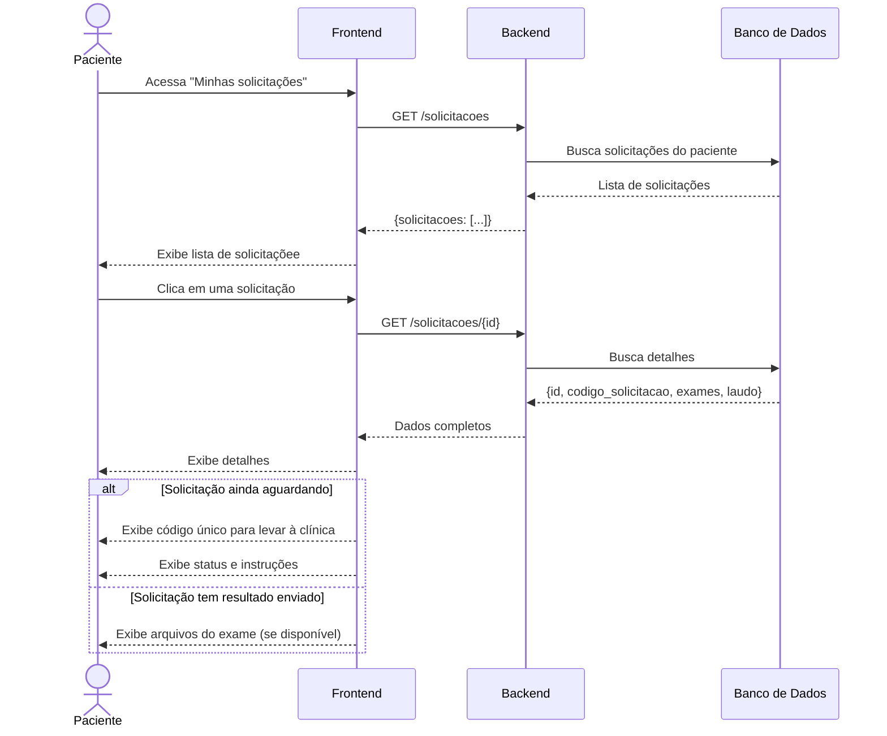

# Diagramas de Sequência

Este documento apresenta os fluxos completos da plataforma de telemedicina através de diagramas de sequência.

---

## 1. Fluxo de Cadastro e Autenticação

### 1.1. Cadastro de Médico/Funcionário

### 1.2. Login de Usuário

---

## 2. Fluxo de Solicitação de Exame

### 2.1. Médico Solicita Exame para Paciente Existente

### 2.2. Médico Solicita Exame e Cadastra Novo Paciente

---

## 3. Fluxo de Upload de Resultado pelo Funcionário

---

## 4. Fluxo de Laudagem pelo Médico

### 4.1. Primeira Etapa - Seleção de Exames

### 4.2. Segunda Etapa - Criação do Laudo

---

## 5. Fluxo de Visualização pelo Paciente

### 5.1. Paciente Acessa suas Solicitações

### 5.2. Paciente Visualiza Laudo

---

## 6. Fluxo do Dashboard do Médico

---

## 7. Fluxo de Atualização de Status

### 7.1. Médico Cancela Solicitação

---

## Notas Técnicas

### Autenticação

- Todas as rotas protegidas requerem `Authorization: Bearer {token}` no header
- O token JWT contém: `user_id`, `email` `tipo`, `nome`, `exp`

### Status das Solicitações

1. **AGUARDANDO_RESULTADO**: Criada pelo médico, aguardando upload
2. **RESULTADO_ENVIADO**: Funcionário enviou o resultado
3. **CANCELADO**: Médico cancelou a solicitação

### Status dos Laudos

1. **RASCUNHO**: Laudo em elaboração
2. **FINALIZADO**: Laudo concluído e disponível ao paciente

### Observações de Segurança

- Pacientes só acessam suas próprias solicitações e laudos
- Funcionários não têm acesso a dados de médicos e pacientes
- Médicos só acessam pacientes vinculados às suas solicitações
- Arquivos médicos devem ser armazenados com controle de acesso rigoroso
